# cmpe273-week1-lab1

## How to Run Locally

### Service A

Open the terminal and run:

```powershell
step 1: cd python-http
step 2: .\.venv\Scripts\Activate.ps1
step 3: python service_a.py
```

Service A runs on port `8080`.

### Service B

Open a second terminal and run:

```powershell
step 1: cd python-http
step 2: .\.venv\Scripts\Activate.ps1
step 3: python service_b.py
```

Service B runs on port `8081`.

### Test

Test Service A in a browser:

http://localhost:8080/health
http://localhost:8080/echo?msg=hi

Test Service B in a browser:

http://localhost:8081/health
http://localhost:8081/call-echo?msg=hi

## Success Proof

### Test Service A in a browser:

#### http://localhost:8080/health

request and response:
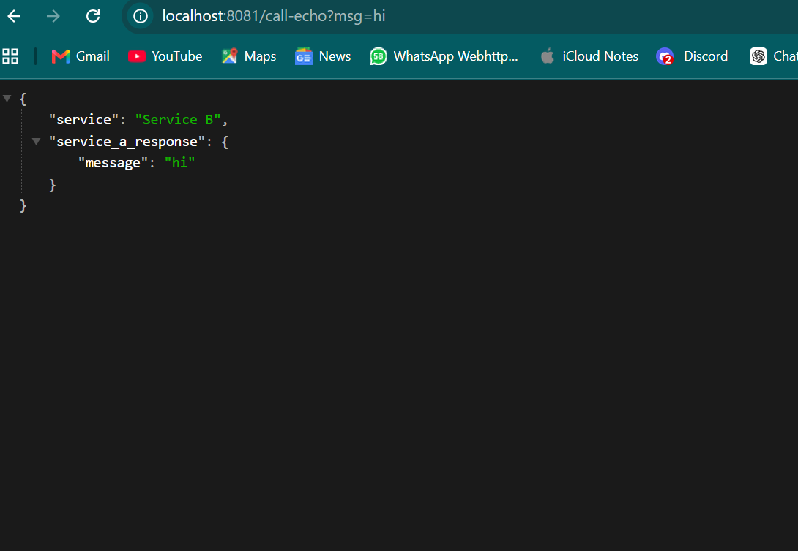

log:
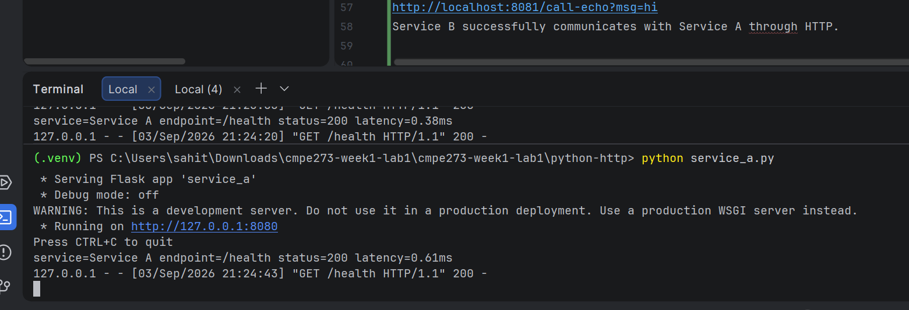

---

#### http://localhost:8080/echo?msg=hi

request and response:
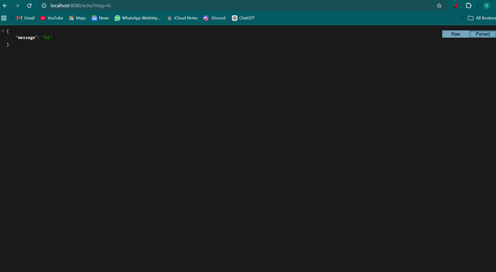

log:
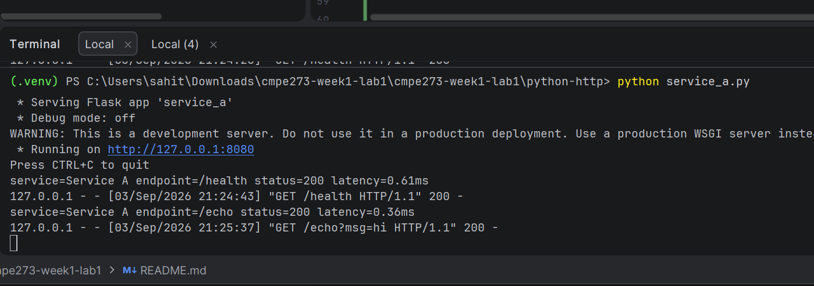

---
### Test Service B in a browser:

#### http://localhost:8081/health

request and response:


log:
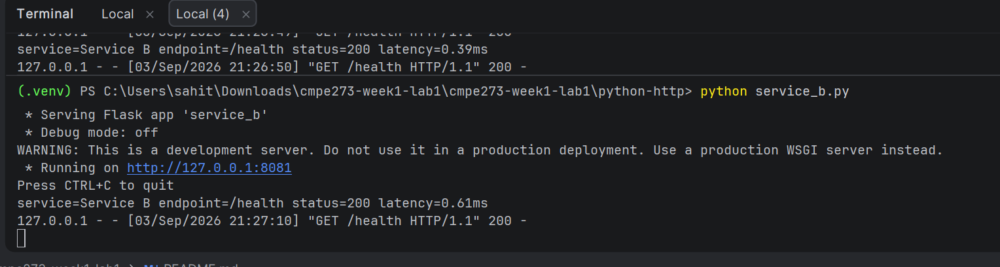

---
#### http://localhost:8081/call-echo?msg=hi

request and response:
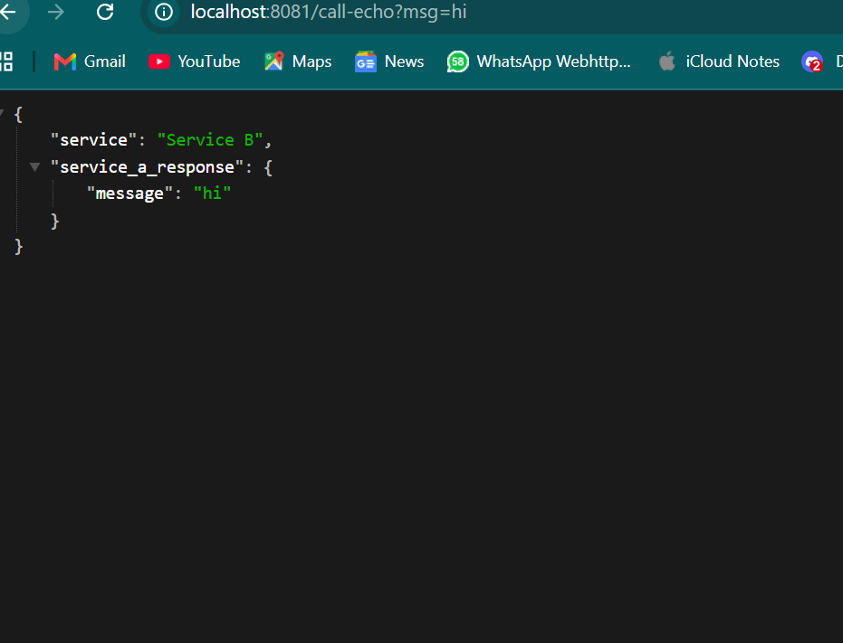

log of Service B:
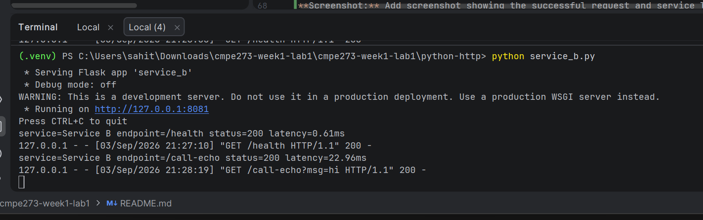

log of Service A:
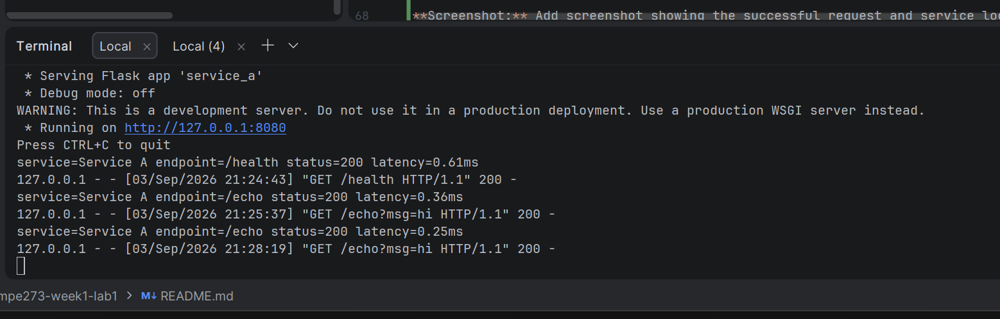

Service B successfully communicates with Service A through HTTP.

---
## Failure Proof

Press CTLR+C in Service A terminal to stop Service A
Service A was stopped while Service B continued running. Service B attempted to contact Service A, timed out, and returned HTTP `503`.


### Service A stopped
log of Service A:
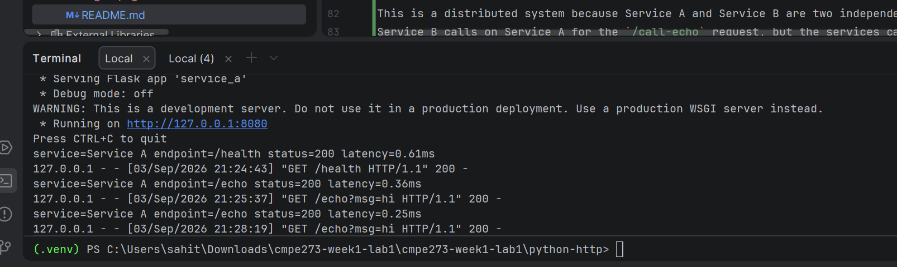

### Test Service B in a browser:
#### http://localhost:8081/call-echo?msg=hi

request and response:
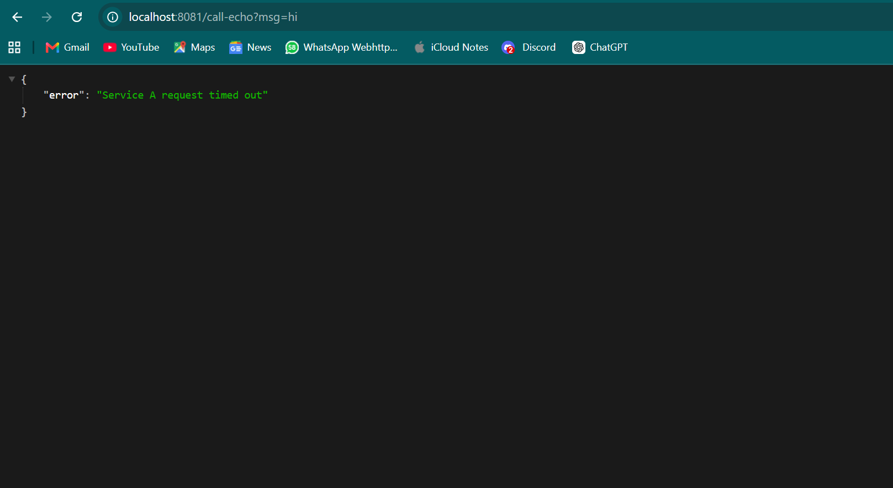

log of Service B:
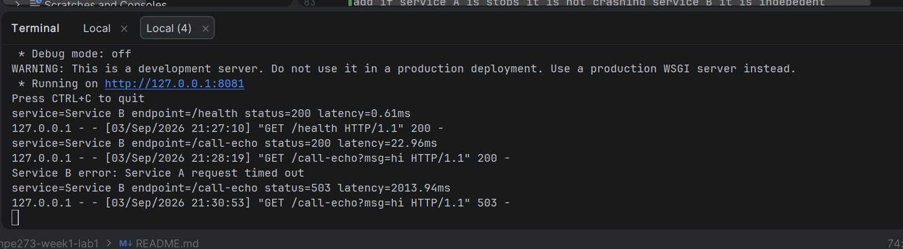


## What Makes This Distributed?

This is a distributed system because Service A and Service B are two independent processes running on different ports and communicating with each other over HTTP. Service B sends a request to Service A when request send to the /call-echo endpoint in Service B, so the services depend on network communication to complete the request and the flow. However, they are still independent services, meaning one service can run, stop or fail without directly crashing the other. For example, when Service A is stopped, Service B continues running and is still able to receive requests. Instead of crashing when it cannot reach Service A, Service B detects the failure and handles the timeout and returns a 503 response. This shows that the services are separate and can handle failures independently.